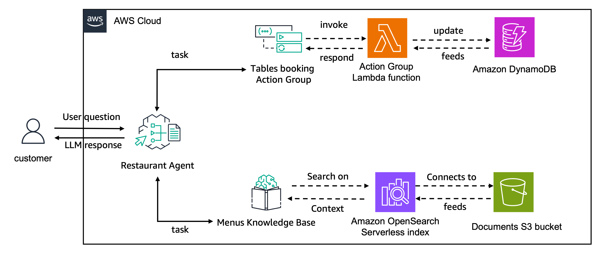
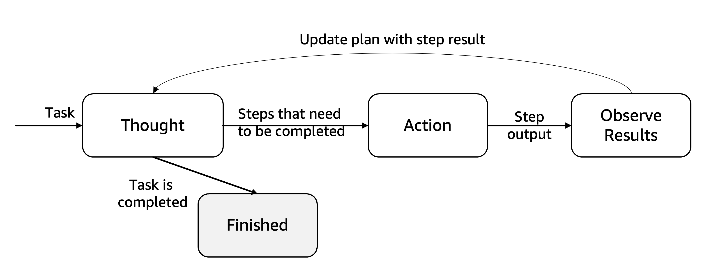
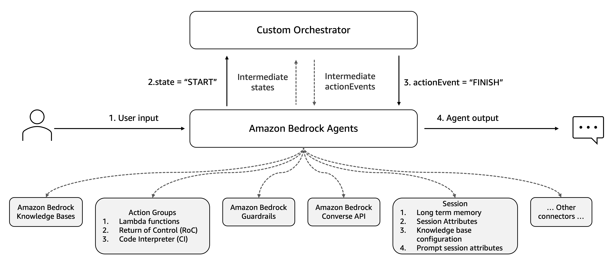

---
tags:
    - Agents/ Custom-Orchestration
    - API-Usage-Example
---

!!! tip inline end "[Open in github](https://github.com/aws-samples/amazon-bedrock-samples/blob/main/agents-and-function-calling/bedrock-agents/features-examples/14-create-agent-with-custom-orchestration/custom_orchestration_example.ipynb){:target="_blank"}"

<!-- <h2>Creating Bedrock Agents with Custom Orchestration</h2> -->

In this notebook, we will show you how to create an agent using a custom orchestration strategy. 

[Amazon Bedrock Agents](https://aws.amazon.com/bedrock/agents/){:target="_blank"} streamlines the development of generative AI applications by offering a fully managed solution that uses foundation models and augmenting tools to autonomously run tasks and achieve objectives through orchestrated, multi-step workflows. The default orchestration strategy, Reasoning and Action ([ReAct](https://arxiv.org/abs/2210.03629){:target="_blank"}), enables users to quickly build and deploy agentic solutions. ReAct is a general problem-solving approach that leverages the foundation model's planning capabilities to dynamically adjust actions at each step. While ReAct offers flexibility by allowing agents to continuously re-evaluate their decisions based on shifting requirements, its iterative approach can lead to higher latency when a large number of tools are involved. 

For greater orchestration control, Amazon Bedrock Agents has launched the [custom orchestrator]() feature, which enables users to fine-tune agent behavior and manage tool interactions at each workflow step. This customization allows organizations to tailor agent functionality to their specific operational needs, improving precision, adaptability, and efficiency. 

In this notebook, we’ll reuse our restaurant example to explore how custom orchestrators work and demonstrate their application with an Reasoning Without Observation ([ReWOO](https://arxiv.org/abs/2305.18323)) example. The image below shows the architecture of the agent we will create:

{align=center}

During this notebook we will:
1. Create an [Amazon Knowledge Base](https://aws.amazon.com/bedrock/knowledge-bases/) to index our restaurant menus
2. Create and test our restaurant assistant using the default ReAct strategy
3. Create and test our restaurant assistant using the new custom orchestration feature with ReWoo
4. Delete all components to avoid unexpected costs

<h3>Installing and importing prerequisites</h3>
Before starting let's update our boto3 packages with the latest functionalities and install any pre-requisite packages


```python
!python3 -m pip install --force-reinstall --no-cache -r requirements.txt 
```

Now we can import the required packages for this example.

We will also inport some helper functionalities available in `agents.py` and `knowledge_bases.py`. Those functions will help us creating the knowledge base and our agents easier. They use the boto3 clientes for `bedrock-agents` and `bedrock-agents-runtime`. You can check the implementation those functions in the provided files. In this notebook we will highlight the differences in the [CreateAgent](https://docs.aws.amazon.com/bedrock/latest/APIReference/API_agent_CreateAgent.html) and [InvokeAgent](https://docs.aws.amazon.com/bedrock/latest/APIReference/API_agent-runtime_InvokeAgent.html){:target="_blank"} APIs for the custom orchestrator.


```python
import boto3
import json
import time
import sys
import os
from agents import create_agent, invoke_agent_helper, clean_up_resources
from knowledge_bases import KnowledgeBasesForAmazonBedrock
```

<h2>1. Creating Knowledge Base</h2>
Let's create a restaurant assistant Knowledge Base to index the menus of our restaurant. To do so we first need to set some constants for the knowledge base name and description as well as a name for the s3 bucket that will store the documents indexed in the knowledge base


```python
s3_client = boto3.client('s3')
sts_client = boto3.client('sts')
session = boto3.session.Session()
region = session.region_name
account_id = sts_client.get_caller_identity()["Account"]
knowledge_base_name = f'restaurant-kb'
suffix = f"{region}-{account_id}"
knowledge_base_description = "Knowledge Base containing the restaurant menu's collection"
bucket_name = f'restaurant-kb-{suffix}'
```


```python
kb = KnowledgeBasesForAmazonBedrock()
kb_id, ds_id = kb.create_or_retrieve_knowledge_base(
    knowledge_base_name,
    knowledge_base_description,
    bucket_name
)
```

<h3>Syncronizing data to knowledge base</h3>

Next let's syncronize the knowledge base to index the menus


```python
def upload_directory(path, bucket_name):
    for root,dirs,files in os.walk(path):
        for file in files:
            file_to_upload = os.path.join(root,file)
            print(f"uploading file {file_to_upload} to {bucket_name}")
            s3_client.upload_file(file_to_upload,bucket_name,file)
```


```python
upload_directory("kb_docs", bucket_name)

# sync knowledge base
kb.synchronize_data(kb_id, ds_id)
```

<h2>Creating ReAct Agent</h2>

Over the next cells we will create a ReAct agent `restaurant-react` and invoke with the Bedrock Agent's default orchestration and invoke it.

The ReAct approach is an iterative decision-making process where the model analyzes each step, deciding on the next action based on the information gathered at each stage

{align=center}

This method provides transparency and allows for a clear, step-by-step breakdown of actions, making it well-suited for workflows that benefit from incremental adjustments. While effective in dynamic environments where real-time re-evaluation is advantageous, ReAct’s sequential structure can introduce latency when high-speed or parallel processing across multiple tools is required.

<h3>Defining agent configuration</h3>

Let's now define the configuration for our restaurant assistant. Let's provide some data of what to do in case of situations where the agent cannot answer the user query and some more generic information about the restaurant

```
You are a restaurant assistant helping ‘The Regrettable Experience’ handle reservations. You can talk about the menus, create new bookings, get the details of an existing booking or delete an existing reservation. You reply always politely and mention the name of the restaurant in the reply. NEVER skip the name of the restaurant in the start of a new conversation. If customers ask about anything that you cannot reply, please provide the following phone number for a more personalized experience: +1 999 999 99 9999.

Some information that will be useful to answer your customer's questions:
The Regrettable Experience Address: 101W 87th Street, 100024, New York, New York
Opening hours: 
- Mondays - Fridays: 11am - 2pm and 5pm - 10pm
- Saturdays: 11am - 11pm
- Sundays: 11am - 8pm
```

For this agent, we will also use `Claude 3 Sonnet 3.5 v2` model in order to provide more accurate answers to our users.

For the action group we will provide 3 functions:
* `get_booking_details` to retrieve the details of an existing booking
* `create_booking` to create a new restaurant reservation and
* `delete_booking` to delete an existing reservation

Finally, we also provide some knowledge base configuration including a `kb_instruction` of when to use this knowledge base


```python
agent_name_react = 'restaurant-a-react'
agent_foundation_model = "anthropic.claude-3-5-sonnet-20241022-v2:0"
agent_instruction = """You are a restaurant assistant helping ‘The Regrettable Experience’ handle reservations. 
You can talk about the menus, create new bookings, get the details of an existing booking or delete an existing reservation. 
You reply always politely and mention the name of the restaurant in the reply. 
NEVER skip the name of the restaurant in the start of a new conversation. 
If customers ask about anything that you cannot reply, please provide the following phone number for a more personalized experience: 
+1 999 999 99 9999.

Some information that will be useful to answer your customer's questions:
The Regrettable Experience Address: 101W 87th Street, 100024, New York, New York
Opening hours: 
- Mondays - Fridays: 11am - 2pm and 5pm - 10pm
- Saturdays: 11am - 11pm
- Sundays: 11am - 8pm"""
agent_description = "Agent in charge of a restaurants table bookings"

functions = [
    {
        'name': 'get_booking_details',
        'description': 'Retrieve details of a restaurant booking',
        'parameters': {
            "booking_id": {
                "description": "The ID of the booking to retrieve",
                "required": True,
                "type": "string"
            }
        }
    },
    {
        'name': 'create_booking',
        'description': 'Create a new restaurant booking',
        'parameters': {
            "date": {
                "description": "The date of the booking in the format YYYY-MM-DD",
                "required": True,
                "type": "string"
            },
            "name": {
                "description": "Name to idenfity your reservation",
                "required": True,
                "type": "string"
            },
            "hour": {
                "description": "The hour of the booking in the format HH:MM",
                "required": True,
                "type": "string"
            },
            "num_guests": {
                "description": "The number of guests for the booking",
                "required": True,
                "type": "integer"
            }
        }
    },
    {
        'name': 'delete_booking',
        'description': 'Delete an existing restaurant booking',
        'parameters': {
            "booking_id": {
                "description": "The ID of the booking to delete",
                "required": True,
                "type": "string"
            }
        }
    },
]

action_group_config_react = {
    'name': 'TableBookingsActionGroup',
    'description': 'Actions for getting table booking information, create a new booking or delete an existing booking',
    'functions': functions,
    'lambda_function_name': f'{agent_name_react}-lambda',
    'lambda_file_path': 'lambda_function.py',
    'environment': {
        'Variables': {
            'booking_table_name': f'{agent_name_react}-table'
        }
    },
    'dynamodb_table_name': f'{agent_name_react}-table',
    'dynamodb_attribute_name': 'booking_id'
}

kb_config = {
    'kb_id': kb_id,
    'kb_instruction': 'Access the knowledge base when customers ask about the plates in the menu.'
}
```

<h3>Creating agent</h3>


```python
ra_react_agent_id, ra_react_agent_alias_id, ra_react_agent_alias_arn, react_orchestration_lambda_function = create_agent(
    agent_name_react,
    agent_instruction,
    agent_foundation_model=agent_foundation_model,
    agent_description=agent_description,
    action_group_config=action_group_config_react,
    kb_config=kb_config,
    create_alias=False
)
```

<h3>Getting created agent configuration</h3>
Let's now check the agent_id and agent_alias_id values. Those will be required to invoke your agent.
As we did not create an agent version, our agent alias is set to the test value of `TSTALIASID`


```python
ra_react_agent_id, ra_react_agent_alias_id
```

<h2>Invoking ReAct Agent</h2>
Next we will invoke the ReAct agent with a couple of queries. We will use session attributes to pass the current date and customer name in order to make the agent more relatable with a real life restaurant assistant


```python
from datetime import datetime
today = datetime.today().strftime('%b-%d-%Y')
today
```

<h3>Invoking ReAct agent with action group only query</h3>
first let's invoke our agent with a query calling only the action group to book a reservation. We will use the magic command `%%time` to measure the latency of our requests


```python
%%time
import uuid
session_id:str = str(uuid.uuid1())

query = "Can you make a reservation for 2 people, at 7pm tonight?"
session_state={
    "promptSessionAttributes": { 
         "Customer Name" : "John",
         "Today": today
      },
}
response = invoke_agent_helper(
    query, session_id, ra_react_agent_id, ra_react_agent_alias_id, enable_trace=False, session_state=session_state
)
print(response)
```

<h3>Invoking ReAct agent with knowledge base query</h3>
Next we will check what is on the menu in order to invoke our agent with a query to the Knowledge Base only


```python
time.sleep(60)
```


```python
%%time
import uuid
session_id:str = str(uuid.uuid1())

query = "What do you serve for dinner?"
response = invoke_agent_helper(
    query, session_id, ra_react_agent_id, ra_react_agent_alias_id, enable_trace=False, session_state=None
)
print(response)
```

<h3>Invoking ReAct agent with Action Group and Knowledge Base query</h3>
Now let's try to invoke our agent with a more complex query that requires a plan that will check for the menu and book a reservation


```python
time.sleep(60)
```


```python
%%time
import uuid
session_id:str = str(uuid.uuid1())

query = "What do you serve for dinner? can you make a reservation for 4 people, at 9pm tonight."
session_state={
    "promptSessionAttributes": { 
         "Customer Name" : "Maria",
         "Today": today
      },
}
response = invoke_agent_helper(
    query, session_id, ra_react_agent_id, ra_react_agent_alias_id, enable_trace=True, session_state=session_state
)
print(response)
```

<h2>Creating ReWoo Agent</h2>
Over the next cells we will create a ReWoo agent `restaurant-rewoo` using Bedrock Agent's custom orchestrator and we will invoke it with the the same customer orchestrator.

The ReWOO technique optimizes performance by generating a complete task plan up front and executing it without checking intermediate outputs.

{align=center}

This approach minimizes model calls, potentially reducing response times. For tasks where speed is prioritized over iterative adjustments—or where the intermediate reasoning steps should remain hidden for security reasons—ReWOO offers clear advantages over the default ReAct strategy.

<h3>Defining agent configuration</h3>
The agent configuration remains basicaly the same, with the exception of the custom orchestration lambda that needs to be created. The file `lambda_rewoo.py` has the code for the orchestration. 

The custom orchestrator enables dynamic decision-making and adaptable workflow management through contract-based interactions between Amazon Bedrock Agents and AWS Lambda. The AWS Lambda function acts as the orchestration engine, processing contextual inputs—such as state, conversation history, session parameters, and user requests—to generate instructions and define the state for subsequent actions. Upon receiving user input, Amazon Bedrock Agents uses the custom orchestrator logic and the [Amazon Bedrock Converse API](https://docs.aws.amazon.com/bedrock/latest/APIReference/API_runtime_Converse.html) to manage interactions between the underlying foundation model and various tools, such as action groups, knowledge bases, and guardrails.


The following diagram illustrates the flow of interactions between the user, Amazon Bedrock Agents, and the custom orchestrator, which manages the workflow:




```python
agent_name_rewoo = 'restaurant-a-rewoo'
custom_orchestration_lambda_name = 'rewoo-o-lambda'
custom_orchestration_lambda_rewoo = {
    'lambda_function_name': custom_orchestration_lambda_name,
    'lambda_file_path': 'lambda_rewoo.py'
}
action_group_config_rewoo = {
    'name': 'TableBookingsActionGroup',
    'description': 'Actions for getting table booking information, create a new booking or delete an existing booking',
    'functions': functions,
    'lambda_function_name': f'{agent_name_rewoo}-lambda',
    'lambda_file_path': 'lambda_function.py',
    'environment': {
        'Variables': {
            'booking_table_name': f'{agent_name_rewoo}-table'
        }
    },
    'dynamodb_table_name': f'{agent_name_rewoo}-table',
    'dynamodb_attribute_name': 'booking_id'
}
ra_rewoo_agent_id, ra_rewoo_agent_alias_id, ra_rewoo_agent_alias_arn, rewoo_orchestration_lambda_function = create_agent(
    agent_name_rewoo,
    agent_instruction,
    agent_foundation_model=agent_foundation_model,
    agent_description=agent_description,
    action_group_config=action_group_config_rewoo,
    kb_config=kb_config,
    custom_orchestration_lambda=custom_orchestration_lambda_rewoo,
    create_alias=False
)
```

<h3>Getting created agent configuration</h3>
Let's now check the agent_id and agent_alias_id values. Those will be required to invoke your agent.
As we did not create an agent version, our agent alias is set to the test value of `TSTALIASID`


```python
ra_rewoo_agent_id, ra_rewoo_agent_alias_id
```

<h2>Invoking ReWoo Agent</h2>
Next we will invoke the ReWoo agent with a couple of queries. We will still use session attributes to pass the current date and customer name in order to make the agent more relatable with a real life restaurant assistant.

To use custom orchestrator, you need to pass the orchestration lambda ARN via `sessionAttribute` in the `sessionState` parameter

<h3>Invoking ReWoo agent with action group only query</h3>
first let's invoke our agent with a query calling only the action group to book a reservation. We will use the magic command `%%time` to measure the latency of our requests


```python
time.sleep(60)
```


```python
%%time
import uuid
session_id:str = str(uuid.uuid1())
session_state={
    "promptSessionAttributes": { 
         "Customer Name" : "John",
         "Today": today
      },
    'sessionAttributes': {
        'lambda': rewoo_orchestration_lambda_function['FunctionArn']
    }
}
query = "Can you make a reservation for 2 people, at 7pm tonight?"
response = invoke_agent_helper(
    query, session_id, ra_rewoo_agent_id, ra_rewoo_agent_alias_id, enable_trace=False, session_state=session_state
)
print(response)
```

<h3>Invoking ReWoo agent with knowledge base query</h3>
Next we will check what is on the menu in order to invoke our agent with a query to the Knowledge Base only


```python
time.sleep(60)
```


```python
%%time
import uuid
session_id:str = str(uuid.uuid1())
session_state={
    'sessionAttributes': {
        'lambda': rewoo_orchestration_lambda_function['FunctionArn']
    }
}
query = "What do you serve for dinner?"
response = invoke_agent_helper(
    query, session_id, ra_rewoo_agent_id, ra_rewoo_agent_alias_id, enable_trace=False, session_state=session_state
)
print(response)
```

<h3>Invoking ReWoo agent with Action Group and Knowledge Base query</h3>
Now let's try to invoke our agent with a more complex query that requires a plan that will check for the menu and book a reservation


```python
time.sleep(60)
```


```python
%%time
import uuid
session_id:str = str(uuid.uuid1())
query = "What do you serve for dinner? can you make a reservation for 4 people, at 9pm tonight."
session_state={
    "promptSessionAttributes": { 
         "Customer Name" : "John",
         "Today": today
      },
    'sessionAttributes': {
        'lambda': rewoo_orchestration_lambda_function['FunctionArn']
    }
}
response = invoke_agent_helper(
    query, session_id, ra_rewoo_agent_id, ra_rewoo_agent_alias_id, enable_trace=True, session_state=session_state
)
print(response)
```

<h3>Comparing ReAct and ReWoo orchestrations</h3>

As we can see in the invocations before, the latency to run simple queries in ReAct and ReWoo is similar. However, with complex multi-step queries, the latency to run a ReWoo orchestration is significantly lower. 

The videos below show case the processing steps to process the query

```
What do you serve for dinner? can you make a reservation for 4 people, at 9pm tonight.
```

For this query, **ReAct** will:
- create a plan to solve the task 1st checking what is served in the dinner menu and then book a reservation
- check the knowledge base for what is served in dinner menu
- evaluate if the plan is still proper to solve the task 
- book the reservation
- evaluate if the plan is still proper to solve the task
- create a final response with the dinner options and booking reservation


```python
from IPython.display import HTML

HTML("""
<video alt="test" controls width="90%">
    <source src="images/react_flow.mp4" type="video/mp4">
</video>
""")
```

For the same query, **ReWoo** will:
- create a plan to solve the task checking what is served in the dinner menu and booking a reservation
- check the knowledege base
- book a reservation
- create a final response with the dinner options and booking reservation


```python
from IPython.display import HTML

HTML("""
<video alt="test" controls width="100%">
    <source src="images/rewoo_flow.mp4" type="video/mp4">
</video>
""")
```

<h2>[Optional] Clean up</h2>

In this optional step we will delete the created resources to avoid unecessary costs


```python
# clean up react agent
clean_up_resources(
    agent_name_react,
    custom_orchestration_lambda_function_name=None,
    dynamodb_table=f'{agent_name_react}-table'
)
```


```python
# clean up rewoo agent
clean_up_resources(
    agent_name_rewoo,
    custom_orchestration_lambda_function_name=custom_orchestration_lambda_name,
    dynamodb_table=f'{agent_name_rewoo}-table'
)
```


```python
# delete kb
kb.delete_kb(
    kb_name=knowledge_base_name, delete_s3_bucket=True, delete_iam_roles_and_policies=True
)
```

<h2>Next Steps</h2>

Congratulations, you have created your first custom orchestrator agent!

As next steps we suggest you experiment with other orchestration strategies. This folder also provides some starting examples for ReAct and ReWoo orchestration using JavaScript and Python code:
- `custom_orchestrators_samples/lambda_react.js` file contains a JavaScript implementation of ReAct. 
- `custom_orchestrators_samples/lambda_react.py` file contains a Python implementation of ReAct. 
- `custom_orchestrators_samples/lambda_rewoo.js` file contains a JavaScript implementation of ReWoo. 

You can use these file to change the default behavior of Bedrock Agent's ReAct implementation and to start creating your own orchestration code. 

**Disclaimer:** Those code samples are provided as a start point for your application. You should validate and update them accordingly to your use case
